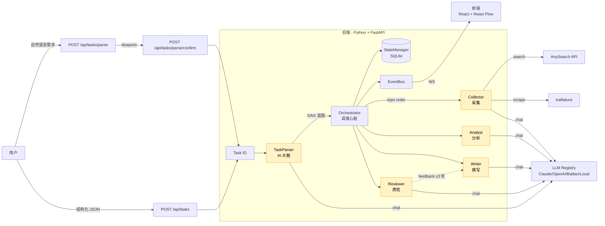

# Scout Hive 架构总览

> 答辩用架构文档：讲清「是什么 / 怎么协作 / 关键决策」。
> 实现细节看 `docs/superpowers/specs/2026-05-21-...` 系列设计文档。

## 整体架构图

```mermaid
flowchart LR
    User[用户] -->|自然语言需求| ParseAPI[POST /api/tasks/parse]
    User -->|结构化 JSON| TasksAPI[POST /api/tasks]
    ParseAPI -->|blueprint| ConfirmAPI[POST /api/tasks/parse/confirm]
    ConfirmAPI --> TaskID[Task ID]
    TasksAPI --> TaskID

    subgraph Backend[后端 - Python + FastAPI]
        TaskID --> TaskParser[TaskParser<br/>AI 大脑]:::agent
        TaskParser -->|DAG 蓝图| Orch[Orchestrator<br/>调度心脏]
        Orch --> SM[(StateManager<br/>SQLite)]
        Orch --> Bus[EventBus]
        Orch -->|topo order| Collector[Collector<br/>采集]:::agent
        Orch --> Analyst[Analyst<br/>分析]:::agent
        Orch --> Writer[Writer<br/>撰写]:::agent
        Orch --> Reviewer[Reviewer<br/>质检]:::agent
        Reviewer -.->|feedback ≤3 轮| Writer
    end

    Collector -->|search| AS[AnySearch API]
    Collector -->|scrape| TC[trafilatura]
    Bus -->|WS| FE[前端<br/>React + React Flow]
    TaskParser & Collector & Analyst & Writer & Reviewer -->|chat| LLM[LLM Registry<br/>Claude/OpenAI/Bailian/Local]

    classDef agent fill:#fef3c7,stroke:#f59e0b,color:#000
```

（图下方的章节将在 Task 7-8 补全）
