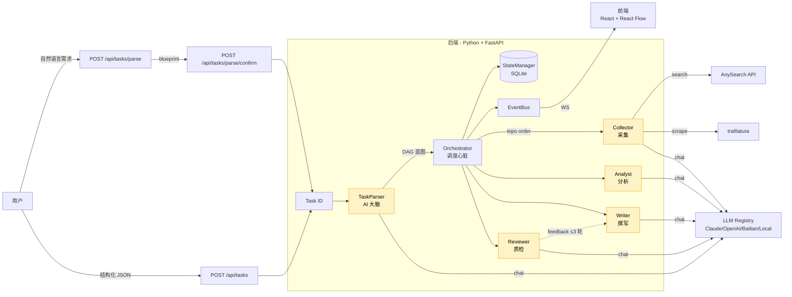

# Scout Hive 架构总览

> 答辩用架构文档：讲清「是什么 / 怎么协作 / 关键决策」。
> 实现细节看 `docs/superpowers/specs/2026-05-21-...` 系列设计文档。

## 整体架构图

（图下方的章节将在 Task 7-8 补全）

---

## 1. 系统定位与课题目标

**课题原文**：「AI 驱动的竞品分析 Agent 协作系统，模拟真实的数字调研小组，通过多个专职 Agent 的协同，自动完成从公开信息采集到结构化竞品报告输出的全链路工作」。

**Scout Hive 的回答**：

| 课题要求 | 系统实现 |
|---------|---------|
| 多个专职 Agent 角色 | TaskParser（大脑）/ Orchestrator（心脏）/ Collector · Analyst · Writer · Reviewer（4 手脚） |
| 自定义竞品知识 Schema | `DEFAULT_SCHEMA`（`backend/app/schema/mvp_defaults.py`），分组 × 维度 |
| DAG 式任务流转 | `Orchestrator` 按拓扑序执行，`feedback_edges` 支持反馈循环 |
| 交叉审查反馈闭环 | `Reviewer` → `Writer` 反馈边，最多 3 轮，超限 `escalation: auto_approve` |
| 公开信息采集 | `Collector` 调 AnySearch（`/v1/search`）+ trafilatura 兜底 |
| 结构化竞品报告 | `Writer` 输出 HTML 报告（每条 claim 带 `quote` + `source_ref`） |
| 结果溯源 | `TraceRecord` 记录每节点 input/output/reasoning_chain/sources |
| 系统可观测性 | WebSocket 事件流 + `TraceBrowser` 组件 + EventBus 内存发布订阅 |

## 2. 整体架构

见上方 Mermaid 图。要点：

- **1 大脑（TaskParser）**：唯一与 LLM 交互理解用户需求的角色，把自然语言转 DAG 蓝图
- **1 心脏（Orchestrator）**：纯代码调度器，按拓扑序触发 AgentNode，维护 StateManager + EventBus
- **4 手脚（Collector/Analyst/Writer/Reviewer）**：分工明确，每角色 LLM 独立配置
- **数据落盘**：StateManager 持久化到 SQLite，支持断点续跑
- **实时通信**：EventBus → WebSocket → 前端 React Flow

## 3. 5 个 Agent 的职责与契约

| Agent | 职责 | 输入 | 输出 | 是否调 LLM |
|-------|------|------|------|-----------|
| TaskParser | 自然语言 → DAG 蓝图 | `{message: str}` | `{competitors, dimensions, dag, summary}` | ✅ |
| Collector | 公开信息采集 | `{target, domain, dimension}` | `RawData{chunks: [...], sources: [...]}` | 部分（query 生成） |
| Analyst | 单维度分析 | `{competitor, dimension, raw_data}` | `AnalysisResult{findings: [...]}` | ✅ |
| Writer | 撰写报告 | `{competitor, dimension, analysis}` | `WriterResult{report_html}` | ✅ |
| Reviewer | 质检 | `{competitor, dimension, report, analysis}` | `ReviewResult{checks, passed, feedback}` | ✅ |

**契约要点**：
- 所有 Agent 输出必须有 `success: bool`
- 失败时填 `error_type`（`json_parse | token_limit | network | topology_error | unknown`）
- 成功时填 `output` + `trace`（TraceRecord）
- LLM 调用的 `reasoning_chain` 由 Agent 自填（不强制）

## 4. DAG 调度与反馈闭环

**DAG 结构**（`backend/app/models/dag.py`）：
- `nodes`: `[{id, agent, action, params, depends_on}]`
- `edges`: `[{from_node, to_node}]`
- `feedback_edges`: `[{from_node, to_node, max_iterations: 3, escalation: auto_approve}]`

**执行流程**（`Orchestrator.execute_mvp`）：
1. 拓扑排序
2. 按序对每个节点：调 `agent.run(input)` → 写 `node_states[id]` → 广播 `node_started/completed/failed`
3. 处理 feedback_edges：若 Reviewer failed，触发 Writer 重跑（带 feedback），最多 3 轮
4. 全部 completed → `task_completed` 事件

**断点续跑**：StateManager 持久化每节点状态，服务重启调 `recover_running_tasks()` 恢复。
