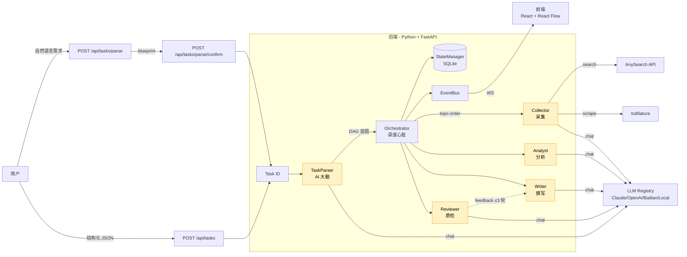

# Scout Hive 架构总览

> 答辩用架构文档：讲清「是什么 / 怎么协作 / 关键决策」。
> 实现细节看 `docs/superpowers/specs/2026-05-21-...` 系列设计文档。

## 整体架构图



（图下方的章节将在 Task 7-8 补全）

---

## 1. 系统定位与课题目标

**课题原文**：「AI 驱动的竞品分析 Agent 协作系统，模拟真实的数字调研小组，通过多个专职 Agent 的协同，自动完成从公开信息采集到结构化竞品报告输出的全链路工作」。

**Scout Hive 的回答**：

| 课题要求 | 系统实现 |
|---------|---------|
| 多个专职 Agent 角色 | TaskParser（大脑）/ Orchestrator（心脏）/ Collector · Analyst · Writer · Reviewer（4 手脚） |
| 自定义竞品知识 Schema | `DEFAULT_SCHEMA`（`backend/app/schema/mvp_defaults.py`），分组 × 维度 |
| DAG 式任务流转 | `Orchestrator` 按拓扑序执行，`feedback_edges` 支持反馈循环 |
| 交叉审查反馈闭环 | `Reviewer` → `Writer` 反馈边，最多 3 轮，超限 `escalation: auto_approve` |
| 公开信息采集 | `Collector` 调 AnySearch（`/v1/search`）+ trafilatura 兜底 |
| 结构化竞品报告 | `Writer` 输出 HTML 报告（每条 claim 带 `quote` + `source_ref`） |
| 结果溯源 | `TraceRecord` 记录每节点 input/output/reasoning_chain/sources |
| 系统可观测性 | WebSocket 事件流 + `TraceBrowser` 组件 + EventBus 内存发布订阅 |

## 2. 整体架构

见上方 Mermaid 图。要点：

- **1 大脑（TaskParser）**：唯一与 LLM 交互理解用户需求的角色，把自然语言转 DAG 蓝图
- **1 心脏（Orchestrator）**：纯代码调度器，按拓扑序触发 AgentNode，维护 StateManager + EventBus
- **4 手脚（Collector/Analyst/Writer/Reviewer）**：分工明确，每角色 LLM 独立配置
- **数据落盘**：StateManager 持久化到 SQLite，支持断点续跑
- **实时通信**：EventBus → WebSocket → 前端 React Flow

## 3. 5 个 Agent 的职责与契约

| Agent | 职责 | 输入 | 输出 | 是否调 LLM |
|-------|------|------|------|-----------|
| TaskParser | 自然语言 → DAG 蓝图 | `{message: str}` | `{competitors, dimensions, dag, summary}` | ✅ |
| Collector | 公开信息采集 | `{target, domain, dimension}` | `RawData{chunks: [...], sources: [...]}` | 部分（query 生成） |
| Analyst | 单维度分析 | `{competitor, dimension, raw_data}` | `AnalysisResult{findings: [...]}` | ✅ |
| Writer | 撰写报告 | `{competitor, dimension, analysis}` | `WriterResult{report_html}` | ✅ |
| Reviewer | 质检 | `{competitor, dimension, report, analysis}` | `ReviewResult{checks, passed, feedback}` | ✅ |

**契约要点**：
- 所有 Agent 输出必须有 `success: bool`
- 失败时填 `error_type`（`json_parse | token_limit | network | topology_error | unknown`）
- 成功时填 `output` + `trace`（TraceRecord）
- LLM 调用的 `reasoning_chain` 由 Agent 自填（不强制）

## 4. DAG 调度与反馈闭环

**DAG 结构**（`backend/app/models/dag.py`）：
- `nodes`: `[{id, agent, action, params, depends_on}]`
- `edges`: `[{from_node, to_node}]`
- `feedback_edges`: `[{from_node, to_node, max_iterations: 3, escalation: auto_approve}]`

**执行流程**（`Orchestrator.execute_mvp`）：
1. 拓扑排序
2. 按序对每个节点：调 `agent.run(input)` → 写 `node_states[id]` → 广播 `node_started/completed/failed`
3. 处理 feedback_edges：若 Reviewer failed，触发 Writer 重跑（带 feedback），最多 3 轮
4. 全部 completed → `task_completed` 事件

**断点续跑**：StateManager 持久化每节点状态，服务重启调 `recover_running_tasks()` 恢复。

## 5. 数据模型

**3 层数据**：

```
用户输入 → TaskInput{competitors[], dimensions[]}
            ↓
执行中 → TaskState{task_id, status, node_states, dag_json, traces, reviews}
            ↓
终态 → ReportPayload{report_html, full_traces, full_reviews}
```

**核心 Pydantic 模型**（`backend/app/models/`）：

| 模型 | 关键字段 | 用途 |
|------|---------|------|
| `Task` | task_id, status, competitors, dimensions, dag_json, node_states | 任务状态 |
| `DAGNode` | id, agent, action, params, depends_on | DAG 节点 |
| `DAGEdge` | from_node, to_node | DAG 边 |
| `FeedbackEdge` | from_node, to_node, max_iterations, escalation | 反馈边 |
| `TraceRecord` | trace_id, node_id, agent, timestamp, input_refs, output, reasoning_chain, sources, llm_metadata, error_message | 单节点 trace |
| `Claim` | claim_id, claim_text, quote, source_ref, quote_type, confidence(已弃用) | 分析结论 |
| `AnalysisResult` | findings: [Claim] | Analyst 输出 |
| `ReviewCheck` | check_id, criterion, passed, evidence | Reviewer 输出 |

**Schema 驱动**（`backend/app/schema/mvp_defaults.py`）：
- `DEFAULT_SCHEMA`：定义 `groups: [{name, dimensions: [{name, keywords, output_type, evidence_threshold, tracking_sources}]}]`
- `Collector` / `Analyst` 按 `dim_config` 调 LLM
- LLM 自由发挥 = 质量不可控（spec 决策记录）

## 6. 关键设计决策

### 6.1 「1 大脑 + 1 心脏 + N 手脚」分层

**为什么**：把 LLM 决策（TaskParser）与代码调度（Orchestrator）解耦，调度逻辑可单元测试。

**权衡**：TaskParser 输出需要严格 JSON Schema 校验（失败重试 1 次，再失败 422 返错给用户，不降级到结构化路径）。

### 6.2 feedback_edges 与主 edges 分离

**为什么**：让主流程（Collector → Analyst → Writer）是 DAG，反馈（Reviewer → Writer）是带计数的循环。

**权衡**：3 轮上限是 hard-coded，超限强制 `escalation: auto_approve`。可调，但目前未做配置化（YAGNI）。

### 6.3 两条入口（parse / tasks）

**为什么**：
- `POST /api/tasks`（结构化）：调试与已有竞品清单
- `POST /api/tasks/parse` → `/confirm`（NLP）：用户自然语言驱动

**权衡**：维护 2 套入口 = 双倍测试成本。决策：parse 路径的维度强制在 `DEFAULT_SCHEMA` 内，不允许 LLM 自由发挥。

### 6.4 溯源铁律

**为什么**：课题强调「每条分析结论均有据可查」。

**做法**：
- `Claim` 强制 `quote + source_ref`，无引用直接丢弃
- `quote_type: "paraphrased"` 时 confidence 权重 ×0.7
- 写死逻辑，不做软提示

### 6.5 适配层而非多 LLM 直调

**为什么**：4 个 LLM provider（Claude/OpenAI/Bailian/Local）的 SDK 差异巨大，封装为 `LLMAdapter` 后业务无感。

**做法**：`LLMRegistry` 工厂按 `config.llm.adapters` 创建实例，支持按 Agent 绑定不同模型（如 Reviewer 用便宜模型，Analyst 用强模型）。

### 6.6 SQLite 而非 Postgres

**为什么**：单文件、零部署、断点续跑够用。

**权衡**：并发写性能上限 ~1000 TPS。对本系统（任务级别串行）足够。生产化时需迁 Postgres。

## 7. 已知限制与不做事项

按 spec（`2026-06-06-core-demo-readiness-design.md`）明确不做的：

- ❌ Docker / docker-compose
- ❌ CI/CD（无 GitHub Actions / 自动化测试流水线）
- ❌ 监控（无 OTel / metrics，仅 logging）
- ❌ 限流 / 防滥用（API 完全开放）
- ❌ 性能压测（无 benchmark）
- ❌ 数据库迁移工具（SQLite + ALTER TABLE 够用）
- ❌ 答辩 Demo 脚本 / 录屏材料
- ❌ 前端测试（无 cypress / playwright）
- ❌ 真实 LLM 跑通已用 `scripts/demo_e2e.py` 解决（见 Section 1）

**已识别的技术债**：
- confidence 概念已清理（commit 5f8b121），但旧文档可能残留
- `bash.exe.stackdump` 在 frontend/ 下（WSA 残留），可清理
- 任何 LLM 调用都未做 cost 估算 / quota 监控（运行 3 个竞品约消耗 ~50k tokens）
