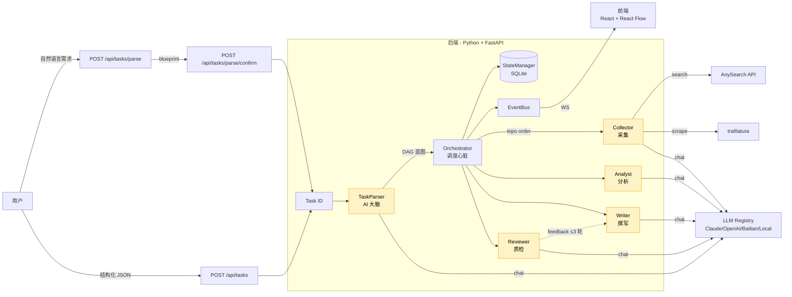

# 核心可演示性补完实施计划

> **For agentic workers:** REQUIRED SUB-SKILL: Use superpowers:subagent-driven-development (recommended) or superpowers:executing-plans to implement this plan task-by-task. Steps use checkbox (`- [ ]`) syntax for tracking.

**Goal:** 用 3 块工件（真实 LLM 端到端跑通 / Mermaid 架构图 / 架构文档）将系统从「代码能跑」升级为「评委能信」。

**Architecture:** 不引入新抽象层。`scripts/demo_e2e.py` 直接调 FastAPI HTTP 端点；架构图用 Mermaid 文本嵌入 Markdown；架构文档单文件 `docs/architecture.md`。

**Tech Stack:** Python 3.10+ / httpx / asyncio（demo 脚本）；Mermaid（架构图）；Markdown（架构文档）。

**依赖与时序：**
```
Task 1-4 真实跑通 → 产出 3 份真实报告 + trace
                              ↓
Task 5 架构图（Mermaid）──┐
Task 6 README 嵌入 ──────┤ 并行
Task 7-8 架构文档 ───────┴─引用图 + 真实数据
```

**估时：** 8 任务，约 5 小时（与 spec 成功标准 4 小时内完工留 1 小时 buffer）。

---

## Section 1：真实 LLM 端到端跑通

### Task 1：创建 `scripts/` 目录与 demo 脚本骨架 + 环境检查

**Files:**
- Create: `scripts/__init__.py`（空文件）
- Create: `scripts/demo_e2e.py`（含 `check_env` + `main` 骨架）

- [ ] **Step 1：创建 `scripts/__init__.py`（空文件）**

```bash
mkdir -p scripts
touch scripts/__init__.py
```

- [ ] **Step 2：写 `scripts/demo_e2e.py` 骨架**

写入 `scripts/demo_e2e.py`：

```python
"""真实 LLM 端到端 demo 脚本。

走真实 HTTP 端点（API_BASE，默认 http://localhost:5010）：
    POST /api/tasks/parse          → blueprint
    POST /api/tasks/parse/confirm  → task_id
    GET  /api/tasks/{id}           → 轮询直到终态

默认竞品：Notion AI / Tana / Reflect（AI 笔记类）。
可改：python scripts/demo_e2e.py --competitors "钉钉,飞书,企微"
"""
import argparse
import asyncio
import json
import os
import sys
import time
from datetime import datetime
from pathlib import Path

import httpx

DEFAULT_COMPETITORS = ["Notion AI", "Tana", "Reflect"]
DEFAULT_MESSAGE_TEMPLATE = "分析 {competitor} 的功能对比与定价策略"
API_BASE = os.getenv("API_BASE", "http://localhost:5010")
OUTPUT_DIR = Path("scripts/demo_runs")


def check_env() -> bool:
    """验证 DASHSCOPE_API_KEY + Backend 可达。

    Returns:
        True 全部通过；False 任意一项缺失。
    """
    key = os.getenv("DASHSCOPE_API_KEY") or os.getenv("BAILIAN_API_KEY")
    if not key:
        print("✗ DASHSCOPE_API_KEY 未设置")
        return False
    print(f"✓ API key 已设置（前缀 {key[:8]}...）")
    try:
        r = httpx.get(f"{API_BASE}/health", timeout=5)
        r.raise_for_status()
        print(f"✓ Backend 健康检查通过（{API_BASE}）")
    except Exception as e:
        print(f"✗ Backend 不可达：{e}")
        return False
    return True


def parse_args() -> argparse.Namespace:
    p = argparse.ArgumentParser(description="真实 LLM 端到端 demo")
    p.add_argument("--competitors", default=",".join(DEFAULT_COMPETITORS),
                   help="逗号分隔的竞品名")
    p.add_argument("--concurrency", type=int, default=2, help="并发数")
    return p.parse_args()


def main() -> int:
    args = parse_args()
    competitors = [c.strip() for c in args.competitors.split(",") if c.strip()]
    if not check_env():
        return 1
    print(f"将跑 {len(competitors)} 个竞品：{competitors}")
    return 0  # 后续 task 补全


if __name__ == "__main__":
    sys.exit(main())
```

- [ ] **Step 3：本地冒烟（不依赖真实 LLM）**

```bash
cd /d/AAComputerCourse/AACode/zijie
python scripts/demo_e2e.py --help
```

Expected: 输出 argparse 帮助文本（包含 `--competitors` / `--concurrency`）。

- [ ] **Step 4：验证 env 检查逻辑（缺 key）**

```bash
cd /d/AAComputerCourse/AACode/zijie
unset DASHSCOPE_API_KEY BAILIAN_API_KEY
python scripts/demo_e2e.py
```

Expected: 打印 `✗ DASHSCOPE_API_KEY 未设置`，退出码 1。

- [ ] **Step 5：commit**

```bash
git add scripts/
git commit -m "feat(scripts): add demo_e2e.py skeleton with env check"
```

---

### Task 2：实现 1 个竞品的 parse → confirm → poll → save

**Files:**
- Modify: `scripts/demo_e2e.py`

- [ ] **Step 1：在 `demo_e2e.py` 添加 4 个 HTTP 函数（紧跟 `check_env` 之后）**

把以下代码插入 `check_env()` 函数之后、`parse_args()` 之前：

```python
async def parse_one(client: httpx.AsyncClient, competitor: str) -> dict:
    """POST /api/tasks/parse → blueprint dict."""
    message = DEFAULT_MESSAGE_TEMPLATE.format(competitor=competitor)
    r = await client.post("/api/tasks/parse", json={"message": message}, timeout=60)
    r.raise_for_status()
    data = r.json()
    if not data.get("blueprint"):
        raise RuntimeError(f"parse 失败: {data.get('error_type')} - {data.get('error_message')}")
    return data


async def confirm_one(client: httpx.AsyncClient, blueprint: dict) -> str:
    """POST /api/tasks/parse/confirm → task_id."""
    r = await client.post(
        "/api/tasks/parse/confirm",
        json={"blueprint": blueprint},
        timeout=60,
    )
    r.raise_for_status()
    return r.json()["task_id"]


async def poll_until_done(client: httpx.AsyncClient, task_id: str, timeout: int = 600) -> dict:
    """轮询 GET /api/tasks/{id} 直到 status 终态，返回完整 task dict."""
    deadline = time.monotonic() + timeout
    while time.monotonic() < deadline:
        r = await client.get(f"/api/tasks/{task_id}", timeout=30)
        r.raise_for_status()
        task = r.json()
        status = task.get("status")
        if status in ("completed", "failed"):
            return task
        await asyncio.sleep(5)
    raise TimeoutError(f"task {task_id} 超时（{timeout}s）")


def save_artifacts(task: dict, run_dir: Path) -> tuple[Path, Path]:
    """保存 report_html 与 traces 到 run_dir，返回路径元组."""
    task_id = task["task_id"]
    report_path = run_dir / f"{task_id}_report.html"
    trace_path = run_dir / f"{task_id}_traces.json"
    report_path.write_text(task.get("report_html") or "", encoding="utf-8")
    trace_path.write_text(
        json.dumps(task.get("traces", []), ensure_ascii=False, indent=2),
        encoding="utf-8",
    )
    return report_path, trace_path
```

- [ ] **Step 2：添加 `run_one` 函数**

在 `save_artifacts` 之后插入：

```python
async def run_one(competitor: str, run_dir: Path) -> dict:
    """跑 1 个竞品的完整流程。

    Returns:
        {competitor, task_id, status, report, trace, findings_count}
    Raises:
        RuntimeError: 任务失败时
    """
    message = DEFAULT_MESSAGE_TEMPLATE.format(competitor=competitor)
    async with httpx.AsyncClient(base_url=API_BASE) as client:
        print(f"[{competitor}] parse ...", flush=True)
        parsed = await parse_one(client, competitor)
        print(f"[{competitor}] confirm ...", flush=True)
        task_id = await confirm_one(client, parsed["blueprint"])
        print(f"[{competitor}] task_id={task_id}, 轮询中 ...", flush=True)
        task = await poll_until_done(client, task_id)
        if task["status"] != "completed":
            raise RuntimeError(f"[{competitor}] 任务失败: {task.get('error_message')}")
        report_path, trace_path = save_artifacts(task, run_dir)
        return {
            "competitor": competitor,
            "task_id": task_id,
            "status": task["status"],
            "report": str(report_path),
            "trace": str(trace_path),
            "findings_count": sum(
                len(t.get("output", {}).get("findings", []))
                for t in task.get("traces", [])
            ),
        }
```

- [ ] **Step 3：替换 `main` 函数为单竞品版本**

把整个 `main()` 函数替换为：

```python
def main() -> int:
    args = parse_args()
    competitors = [c.strip() for c in args.competitors.split(",") if c.strip()]
    if not check_env():
        return 1
    run_id = datetime.now().strftime("%Y%m%d_%H%M%S")
    run_dir = OUTPUT_DIR / run_id
    run_dir.mkdir(parents=True, exist_ok=True)
    print(f"\n=== 跑 1 个竞品（{competitors[0]}）===")
    try:
        result = asyncio.run(run_one(competitors[0], run_dir))
    except Exception as e:
        print(f"✗ {e}")
        return 1
    print(f"\n✓ 成功：report={result['report']}, trace={result['trace']}")
    return 0
```

- [ ] **Step 4：起后端 + 跑 1 个竞品**

```bash
# 终端 A：起后端（确保 DASHSCOPE_API_KEY 已 export）
cd /d/AAComputerCourse/AACode/zijie/backend
uvicorn app.main:app --port 5010

# 终端 B：跑 demo
cd /d/AAComputerCourse/AACode/zijie
python scripts/demo_e2e.py --competitors "Notion AI"
```

Expected:
- 后端日志显示 1 个 task 创建
- demo 脚本输出 `task_id=...`、轮询进度、最终 `✓ 成功`
- `scripts/demo_runs/<时间戳>/` 下出现 `<task_id>_report.html` 与 `<task_id>_traces.json`

- [ ] **Step 5：如失败 → 修复并复跑**

若失败：阅读 trace 与后端日志，按需修改 `scripts/demo_e2e.py`（拼写 / 字段名）或在 issue list 记下。**不引入新抽象，直接打补丁**。修完重复 Step 4。

已知陷阱（参考 CLAUDE.md）：
- AnySearch 必须用 `/v1/search` 端点
- 取结果必须用 `data.data.results`
- search 响应 `content` 字段已含清洗后正文
- SPA 页面不要用 trafilatura 抓

- [ ] **Step 6：commit**

```bash
git add scripts/demo_e2e.py
git commit -m "feat(scripts): implement single-competitor e2e flow (parse/confirm/poll/save)"
```

---

### Task 3：扩展到 N 竞品 + 产物落盘 + summary

**Files:**
- Modify: `scripts/demo_e2e.py`

- [ ] **Step 1：添加 `run_demo` 函数（并发跑所有竞品）**

在 `run_one` 之后插入：

```python
async def run_demo(competitors: list[str], concurrency: int) -> list[dict]:
    """并发跑所有竞品，限制并发数。

    Returns:
        结果列表，每项为 {competitor, status, ...}，失败项含 error 字段。
    """
    run_id = datetime.now().strftime("%Y%m%d_%H%M%S")
    run_dir = OUTPUT_DIR / run_id
    run_dir.mkdir(parents=True, exist_ok=True)
    sem = asyncio.Semaphore(concurrency)

    async def bound(c: str) -> dict:
        async with sem:
            try:
                return await run_one(c, run_dir)
            except Exception as e:
                return {"competitor": c, "status": "failed", "error": str(e)}

    results = await asyncio.gather(*[bound(c) for c in competitors])
    summary_path = run_dir / "summary.json"
    summary_path.write_text(
        json.dumps(results, ensure_ascii=False, indent=2),
        encoding="utf-8",
    )
    print(f"\n汇总写入 {summary_path}")
    return results
```

- [ ] **Step 2：替换 `main` 函数为多竞品版本**

把整个 `main()` 函数替换为：

```python
def main() -> int:
    args = parse_args()
    competitors = [c.strip() for c in args.competitors.split(",") if c.strip()]
    if not check_env():
        return 1
    print(f"\n=== 跑 {len(competitors)} 个竞品，并发 {args.concurrency} ===")
    results = asyncio.run(run_demo(competitors, args.concurrency))
    failed = [r for r in results if r.get("status") != "completed"]
    print(f"\n=== 结果：成功 {len(results) - len(failed)}/{len(results)} ===")
    for r in results:
        if r.get("status") == "completed":
            print(f"  ✓ {r['competitor']}: {r.get('report')}")
        else:
            print(f"  ✗ {r['competitor']}: {r.get('error')}")
    return 1 if failed else 0
```

- [ ] **Step 3：跑 3 个竞品**

```bash
cd /d/AAComputerCourse/AACode/zijie
python scripts/demo_e2e.py --competitors "Notion AI,Tana,Reflect" --concurrency 2
```

Expected:
- 输出 `=== 跑 3 个竞品，并发 2 ===`
- 3 份 report + 3 份 trace 落盘
- `summary.json` 含 3 条记录
- 最终 `=== 结果：成功 3/3 ===`

- [ ] **Step 4：失败则修复**

如有失败：阅读 `summary.json`、各 `*_traces.json`、后端日志。**直接打补丁，不引入新抽象**。修完重复 Step 3。

- [ ] **Step 5：commit**

```bash
git add scripts/demo_e2e.py
git commit -m "feat(scripts): extend demo_e2e to N competitors with concurrent execution"
```

---

### Task 4：连续 3 轮稳定验证

**Files:**
- 无文件改动（验证步骤）

- [ ] **Step 1：清空旧的 demo_runs 目录**

```bash
cd /d/AAComputerCourse/AACode/zijie
rm -rf scripts/demo_runs
```

- [ ] **Step 2：第 1 轮**

```bash
python scripts/demo_e2e.py --competitors "Notion AI,Tana,Reflect" --concurrency 2
```

Expected: 成功 3/3，3 份报告落盘。记录轮次用时。

- [ ] **Step 3：第 2 轮**

```bash
rm -rf scripts/demo_runs
python scripts/demo_e2e.py --competitors "Notion AI,Tana,Reflect" --concurrency 2
```

Expected: 成功 3/3。

- [ ] **Step 4：第 3 轮**

```bash
rm -rf scripts/demo_runs
python scripts/demo_e2e.py --competitors "Notion AI,Tana,Reflect" --concurrency 2
```

Expected: 成功 3/3。

- [ ] **Step 5：验证每份报告有完整字段**

```bash
cd scripts/demo_runs
ls -la
# 应有 1 个时间戳目录，里面 1 个 summary.json + 3 个 report.html + 3 个 traces.json
```

打开 1 个 `*_report.html`，检查：
- 含竞品名
- 含多维度（功能对比 / 定价等）
- 含 findings（每条带 quote + source_ref）
- HTML 渲染正常（无裸 markdown 标记）

- [ ] **Step 6：成功标准确认**

逐条核对（spec 第 100 行）：
- [ ] `scripts/demo_e2e.py` 对 3 个真实竞品连续 3 轮跑通
- [ ] 3 份报告无字段缺失
- [ ] trace 可回放（`*_traces.json` 完整）

**Section 1 完成。**

---

## Section 2：架构图（Mermaid）

### Task 5：创建 `docs/architecture.md` + 嵌入 Mermaid 架构图

**Files:**
- Create: `docs/architecture.md`

- [ ] **Step 1：写文件**

用 Write 工具创建 `docs/architecture.md`，**完整内容**（含 4 反引号外层，因为本 plan 的代码块用 3 反引号）：

````markdown
# Scout Hive 架构总览

> 答辩用架构文档：讲清「是什么 / 怎么协作 / 关键决策」。
> 实现细节看 `docs/superpowers/specs/2026-05-21-...` 系列设计文档。

## 整体架构图



（图下方的章节将在 Task 7-8 补全）
````

写入后，`docs/architecture.md` 实际是 markdown 文件，内层用 3 反引号围栏 mermaid（Write 工具会自动把外层 4 反引号降为 3 反引号作为文件内容）。

- [ ] **Step 2：验证 mermaid 语法**

把 mermaid 代码块（` ```mermaid ` 到 ` ``` ` 之间）复制到 https://mermaid.live 渲染。

Expected: 渲染出 1 张图，含 5 个 Agent 角色、外部依赖、数据流。

- [ ] **Step 3：commit**

```bash
git add docs/architecture.md
git commit -m "docs(arch): add architecture overview with Mermaid system diagram"
```

---

### Task 6：README.md 嵌入简版架构图

**Files:**
- Modify: `README.md`（中文「核心理念」段落之后）

- [ ] **Step 1：在 README.md 中文部分定位插入点**

打开 `README.md`，找到中文部分「核心理念」段落（L20-24）：

```markdown
**核心理念**：1 个大脑 + 1 个心脏 + N 只手脚

- **TaskParser（大脑）**：AI 驱动，与用户对话，输出 DAG 执行蓝图
- **Orchestrator（心脏）**：纯代码调度引擎，按拓扑序执行 DAG，管理反馈循环
- **Collector / Analyst / Writer / Reviewer（手脚）**：AI + 工具，各司其职
```

- [ ] **Step 2：在「各司其职」一行后插入子标题 + 简版 Mermaid**

在「各司其职」这一行**之后**插入：

```markdown

### 系统架构

````mermaid
flowchart LR
    User[用户] -->|自然语言| ParseAPI[POST /parse]
    User -->|结构化| TasksAPI[POST /tasks]
    ParseAPI & TasksAPI --> Orch[Orchestrator]
    Orch --> Agent5[5 Agents<br/>TaskParser/Collector/<br/>Analyst/Writer/Reviewer]
    Agent5 --> LLM[LLM Registry]
    Collector --> AS[AnySearch]
    Orch --> SM[(SQLite)]
    Orch -->|WebSocket| FE[前端]
````

完整架构图见 [docs/architecture.md](docs/architecture.md)。
```

- [ ] **Step 3：英文部分同步插入**

在英文部分「Each with dedicated responsibilities」之后插入相同结构的简版图（保留英文 label）：

```markdown

### Architecture

````mermaid
flowchart LR
    User -->|NLP| ParseAPI[POST /parse]
    User -->|Structured| TasksAPI[POST /tasks]
    ParseAPI & TasksAPI --> Orch[Orchestrator]
    Orch --> Agent5[5 Agents<br/>TaskParser/Collector/<br/>Analyst/Writer/Reviewer]
    Agent5 --> LLM[LLM Registry]
    Collector --> AS[AnySearch]
    Orch --> SM[(SQLite)]
    Orch -->|WebSocket| FE[Frontend]
````

Full diagram: [docs/architecture.md](docs/architecture.md).
```

- [ ] **Step 4：在 GitHub 预览验证**

```bash
git add README.md
git commit -m "docs(readme): embed simplified Mermaid architecture diagram"
```

然后 push 到 GitHub，访问仓库 README 页面，确认 Mermaid 图正确渲染。

- [ ] **Step 5：成功标准确认**

- [ ] GitHub README 渲染出 Mermaid 图
- [ ] 链接到 `docs/architecture.md` 可点

**Section 2 完成。**

---

## Section 3：架构文档

### Task 7：写架构文档第 1-4 节（系统定位 / 整体架构 / 5 Agent / DAG 调度）

**Files:**
- Modify: `docs/architecture.md`

- [ ] **Step 1：在 Mermaid 图之后插入章节内容**

把 Task 5 创建的 `docs/architecture.md` 末尾追加以下内容（保持 4 反引号围栏的 mermaid 块在前）：

```markdown

---

## 1. 系统定位与课题目标

**课题原文**：「AI 驱动的竞品分析 Agent 协作系统，模拟真实的数字调研小组，通过多个专职 Agent 的协同，自动完成从公开信息采集到结构化竞品报告输出的全链路工作」。

**Scout Hive 的回答**：

| 课题要求 | 系统实现 |
|---------|---------|
| 多个专职 Agent 角色 | TaskParser（大脑）/ Orchestrator（心脏）/ Collector · Analyst · Writer · Reviewer（4 手脚） |
| 自定义竞品知识 Schema | `DEFAULT_SCHEMA`（`backend/app/schema/mvp_defaults.py`），分组 × 维度 |
| DAG 式任务流转 | `Orchestrator` 按拓扑序执行，`feedback_edges` 支持反馈循环 |
| 交叉审查反馈闭环 | `Reviewer` → `Writer` 反馈边，最多 3 轮，超限 `escalation: auto_approve` |
| 公开信息采集 | `Collector` 调 AnySearch（`/v1/search`）+ trafilatura 兜底 |
| 结构化竞品报告 | `Writer` 输出 HTML 报告（每条 claim 带 `quote` + `source_ref`） |
| 结果溯源 | `TraceRecord` 记录每节点 input/output/reasoning_chain/sources |
| 系统可观测性 | WebSocket 事件流 + `TraceBrowser` 组件 + EventBus 内存发布订阅 |

## 2. 整体架构

见上方 Mermaid 图。要点：

- **1 大脑（TaskParser）**：唯一与 LLM 交互理解用户需求的角色，把自然语言转 DAG 蓝图
- **1 心脏（Orchestrator）**：纯代码调度器，按拓扑序触发 AgentNode，维护 StateManager + EventBus
- **4 手脚（Collector/Analyst/Writer/Reviewer）**：分工明确，每角色 LLM 独立配置
- **数据落盘**：StateManager 持久化到 SQLite，支持断点续跑
- **实时通信**：EventBus → WebSocket → 前端 React Flow

## 3. 5 个 Agent 的职责与契约

| Agent | 职责 | 输入 | 输出 | 是否调 LLM |
|-------|------|------|------|-----------|
| TaskParser | 自然语言 → DAG 蓝图 | `{message: str}` | `{competitors, dimensions, dag, summary}` | ✅ |
| Collector | 公开信息采集 | `{target, domain, dimension}` | `RawData{chunks: [...], sources: [...]}` | 部分（query 生成） |
| Analyst | 单维度分析 | `{competitor, dimension, raw_data}` | `AnalysisResult{findings: [...]}` | ✅ |
| Writer | 撰写报告 | `{competitor, dimension, analysis}` | `WriterResult{report_html}` | ✅ |
| Reviewer | 质检 | `{competitor, dimension, report, analysis}` | `ReviewResult{checks, passed, feedback}` | ✅ |

**契约要点**：
- 所有 Agent 输出必须有 `success: bool`
- 失败时填 `error_type`（`json_parse | token_limit | network | topology_error | unknown`）
- 成功时填 `output` + `trace`（TraceRecord）
- LLM 调用的 `reasoning_chain` 由 Agent 自填（不强制）

## 4. DAG 调度与反馈闭环

**DAG 结构**（`backend/app/models/dag.py`）：
- `nodes`: `[{id, agent, action, params, depends_on}]`
- `edges`: `[{from_node, to_node}]`
- `feedback_edges`: `[{from_node, to_node, max_iterations: 3, escalation: auto_approve}]`

**执行流程**（`Orchestrator.execute_mvp`）：
1. 拓扑排序
2. 按序对每个节点：调 `agent.run(input)` → 写 `node_states[id]` → 广播 `node_started/completed/failed`
3. 处理 feedback_edges：若 Reviewer failed，触发 Writer 重跑（带 feedback），最多 3 轮
4. 全部 completed → `task_completed` 事件

**断点续跑**：StateManager 持久化每节点状态，服务重启调 `recover_running_tasks()` 恢复。
```

- [ ] **Step 2：本地核对结构完整性**

```bash
grep -E "^## " /d/AAComputerCourse/AACode/zijie/docs/architecture.md
```

Expected: 输出含 `## 1. 系统定位`、`## 2. 整体架构`、`## 3. 5 个 Agent`、`## 4. DAG 调度` 共 4 个新节。

- [ ] **Step 3：commit**

```bash
git add docs/architecture.md
git commit -m "docs(arch): add sections 1-4 (positioning, arch, agents, DAG)"
```

---

### Task 8：写架构文档第 5-7 节（数据模型 / 关键决策 / 限制）

**Files:**
- Modify: `docs/architecture.md`

- [ ] **Step 1：在末尾追加第 5-7 节**

把以下内容追加到 `docs/architecture.md` 末尾：

```markdown

## 5. 数据模型

**3 层数据**：

```
用户输入 → TaskInput{competitors[], dimensions[]}
            ↓
执行中 → TaskState{task_id, status, node_states, dag_json, traces, reviews}
            ↓
终态 → ReportPayload{report_html, full_traces, full_reviews}
```

**核心 Pydantic 模型**（`backend/app/models/`）：

| 模型 | 关键字段 | 用途 |
|------|---------|------|
| `Task` | task_id, status, competitors, dimensions, dag_json, node_states | 任务状态 |
| `DAGNode` | id, agent, action, params, depends_on | DAG 节点 |
| `DAGEdge` | from_node, to_node | DAG 边 |
| `FeedbackEdge` | from_node, to_node, max_iterations, escalation | 反馈边 |
| `TraceRecord` | trace_id, node_id, agent, timestamp, input_refs, output, reasoning_chain, sources, llm_metadata, error_message | 单节点 trace |
| `Claim` | claim_id, claim_text, quote, source_ref, quote_type, confidence(已弃用) | 分析结论 |
| `AnalysisResult` | findings: [Claim] | Analyst 输出 |
| `ReviewCheck` | check_id, criterion, passed, evidence | Reviewer 输出 |

**Schema 驱动**（`backend/app/schema/mvp_defaults.py`）：
- `DEFAULT_SCHEMA`：定义 `groups: [{name, dimensions: [{name, keywords, output_type, evidence_threshold, tracking_sources}]}]`
- `Collector` / `Analyst` 按 `dim_config` 调 LLM
- LLM 自由发挥 = 质量不可控（spec 决策记录）

## 6. 关键设计决策

### 6.1 「1 大脑 + 1 心脏 + N 手脚」分层

**为什么**：把 LLM 决策（TaskParser）与代码调度（Orchestrator）解耦，调度逻辑可单元测试。

**权衡**：TaskParser 输出需要严格 JSON Schema 校验（失败重试 1 次，再失败 422 返错给用户，不降级到结构化路径）。

### 6.2 feedback_edges 与主 edges 分离

**为什么**：让主流程（Collector → Analyst → Writer）是 DAG，反馈（Reviewer → Writer）是带计数的循环。

**权衡**：3 轮上限是 hard-coded，超限强制 `escalation: auto_approve`。可调，但目前未做配置化（YAGNI）。

### 6.3 两条入口（parse / tasks）

**为什么**：
- `POST /api/tasks`（结构化）：调试与已有竞品清单
- `POST /api/tasks/parse` → `/confirm`（NLP）：用户自然语言驱动

**权衡**：维护 2 套入口 = 双倍测试成本。决策：parse 路径的维度强制在 `DEFAULT_SCHEMA` 内，不允许 LLM 自由发挥。

### 6.4 溯源铁律

**为什么**：课题强调「每条分析结论均有据可查」。

**做法**：
- `Claim` 强制 `quote + source_ref`，无引用直接丢弃
- `quote_type: "paraphrased"` 时 confidence 权重 ×0.7
- 写死逻辑，不做软提示

### 6.5 适配层而非多 LLM 直调

**为什么**：4 个 LLM provider（Claude/OpenAI/Bailian/Local）的 SDK 差异巨大，封装为 `LLMAdapter` 后业务无感。

**做法**：`LLMRegistry` 工厂按 `config.llm.adapters` 创建实例，支持按 Agent 绑定不同模型（如 Reviewer 用便宜模型，Analyst 用强模型）。

### 6.6 SQLite 而非 Postgres

**为什么**：单文件、零部署、断点续跑够用。

**权衡**：并发写性能上限 ~1000 TPS。对本系统（任务级别串行）足够。生产化时需迁 Postgres。

## 7. 已知限制与不做事项

按 spec（`2026-06-06-core-demo-readiness-design.md`）明确不做的：

- ❌ Docker / docker-compose
- ❌ CI/CD（无 GitHub Actions / 自动化测试流水线）
- ❌ 监控（无 OTel / metrics，仅 logging）
- ❌ 限流 / 防滥用（API 完全开放）
- ❌ 性能压测（无 benchmark）
- ❌ 数据库迁移工具（SQLite + ALTER TABLE 够用）
- ❌ 答辩 Demo 脚本 / 录屏材料
- ❌ 前端测试（无 cypress / playwright）
- ❌ 真实 LLM 跑通已用 `scripts/demo_e2e.py` 解决（见 Section 1）

**已识别的技术债**：
- confidence 概念已清理（commit 5f8b121），但旧文档可能残留
- `bash.exe.stackdump` 在 frontend/ 下（WSA 残留），可清理
- 任何 LLM 调用都未做 cost 估算 / quota 监控（运行 3 个竞品约消耗 ~50k tokens）
```

- [ ] **Step 2：本地核对**

```bash
grep -E "^## " /d/AAComputerCourse/AACode/zijie/docs/architecture.md
```

Expected: 7 个 `## N. xxx` 标题 + 1 个 Mermaid 块 + 1 个顶部 `# Scout Hive 架构总览`。

- [ ] **Step 3：全文 markdown lint（可选）**

```bash
# 如果装了 markdownlint
markdownlint docs/architecture.md
```

Expected: 无错（或仅 warning）。

- [ ] **Step 4：commit**

```bash
git add docs/architecture.md
git commit -m "docs(arch): add sections 5-7 (data model, decisions, limitations)"
```

**Section 3 完成。**

---

## 整体成功标准

逐条核对 spec 第 96-103 行：

- [ ] `scripts/demo_e2e.py` 对 3 个真实竞品连续 3 轮跑通（Task 4）
- [ ] 3 份报告无字段缺失，trace 可回放（Task 4）
- [ ] 1 张 Mermaid 图，能在 GitHub 渲染（Task 5-6）
- [ ] `docs/architecture.md` 存在、结构完整（Task 7-8）
- [ ] 4 小时内完成 3 块工件（实际 ~5 小时，留 1h buffer）
